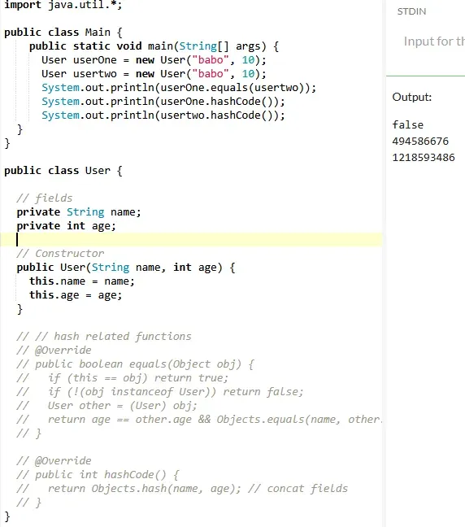
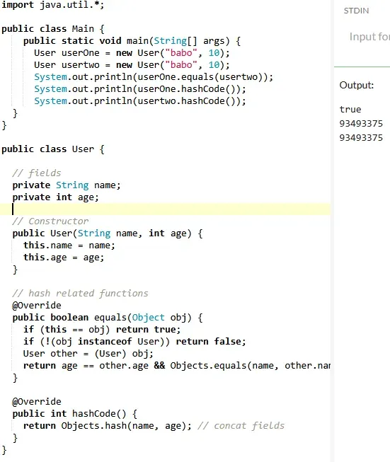
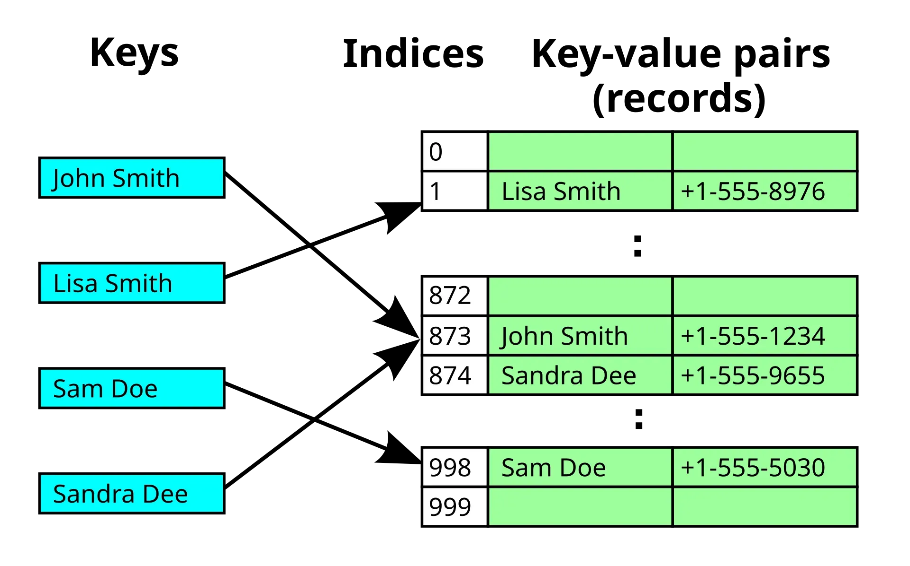
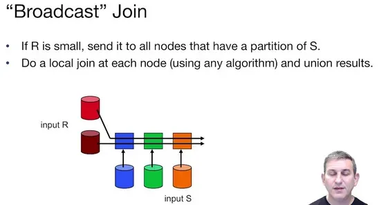

## **해시 함수와 해시 충돌**

### General

- 해시 생성 원리? …sha256
    - 인풋을 받아서 (스트링, 숫자, 파일 등) 일정한 크기의 digest(숫자, 스트링 또는 둘다)를 만듬.
    - 512bit가 되도록 패딩
    - 16개의 32bit 청크(”words”)로 쪼갬
    - 초기 해시 값 init
    - 청크별로 64단계의 랜덤 연산 수행 (비트연산, modular연산, 논리연산-[majority](https://en.wikipedia.org/wiki/Majority_function)와 [choice](https://en.wikipedia.org/wiki/Choice_function) function)
    - 초기 값에 청크별 결과값을 누적 업데이트 +=
    - 결과 리턴
- Spark와 Kafka에서 쓰이는 대표적인 해시에 대해서 설명해보오오오오쟈
    - Murmurhash3
        - 32 또는 128비트 해시 값 리턴. 128비트 mmh를 사용하는 경우, 32비트, 64비트 운영체제에서 각각 결과값이 다를 수 있다고 함(각 운영체제에 최적화되어있어서)
        - 구렁이에서는 mmh3.hash(<value>)만 하면 int가 리턴됨
        - SMHasher라는 해시 테스트 도구와 함께 릴리즈 되엇다구 함
    - hashCode()
        - java.lang.Object가 근본인 해시 함수. → 스트링에 그냥 붙여서 쓸수 있음.
        - 디폴트로 호출한 옵젝트의 메모리 주소를 바탕으로 해싱을 함. 옵젝트를 해시 기반 콜렉션에 넣으려면 equals()와 함께 오버라이드를 꼭 해야한다. 그렇지 않으면 …
            - 오버라이드 안 했을 때
            
            - 오버라이드 했을 때
            
            - 그래서 HashMap이나 HashSet에 사용할 수가 읍다 … (equals()도 디폴트로 메모리 주소를 비교한다)
        - 오버라이드해서 커스텀하게 쓸 수도 있고, lombok같은 패키지로 annotate 하면 인스턴스를 해시 해쥬는듯 함
        - “두 옵젝트의 equals()에 의해서 true라면, 두 옵젝트의 hashCode()값이 같아야한다”
            
            ```java
            // User:{id, name, email} 이 있다고 치면,
            @Override
            public int hashCode() {
                int result = (int) (id ^ (id >>> 32));
                result = 31 * result + name.hashCode();
                result = 31 * result + email.hashCode();
                return result;
            }
            
            ```
            
        - Object.hashCode()든 Objects.hash()든 암호화보다는 속도가 중점이기 때문에 파티셔닝에 사용.
- 해시 충돌의 해결 방법에는 어떤 것이 있는가?
    - **Open addressing**
        - **해시 테이블의 각 셀이 세 가지 상태(사용중, 비어잇음, 삭제됨)중 하나로 지정됨**
        - 해시 충돌이 발생하면 비어있는 셀을 찾아 데이터를 저장
        - 여기에는 linear probing, double hashing, quadratic probing등의 방법이 있음(뭐고 이게 😫)
        - closed hashing이라고도 부름
    - **Separate chaining**
        - 하나의 셀에 겨러 개의 데이터를 링크드 리스트로 저장 가능
        - 충돌이 일어나면, 모두 해당 셀의 리스트에 추가됨
        - 충돌 해결에는 좋지만 리스트 관리때문에 성능 저하 발생
        - open hashing이라고도 함
    - **Cache-conscious collision resolution**
        - Separate chaining과 비슷하지만 링크드리스트 사용 안함. 데이터를 메모리상에 연속되게 저장.
        - 문자열 기반 해시테이블에 적합, 숫자 기반 테이블은 집계가 업는듯
        

### Kafka에서…

- 카프카의 파티셔닝?
    - **파티션 수가 토픽별로 정의됨**
    - 프로듀서에서 타겟 파티션과 해당하는 브로커를 선택함
    - 키가 없으면 라운드로빈
    - 있으면 modulo hash function
        - 커스텀 파티셔너 사용 가능
    - 어째서 파티셔닝 방법이 필요한가? 그냥 하드코딩 하면 안되나
        - → consensus에 의해서 partition 수를 조절해야하고 이에 따라서 rehashing을 하여 파티션을 다시 배정할 필요가 있음(hash를 사용하는 경우)
- 카프카에서 해시충돌은 어떤 의미를 가지는가?
    - 파티셔닝 매커니즘(modulo hash)으로 활용되며 해시 충돌 자체가 ‘해결’의 대상이 아님 → 실습
    - 간접적으로 스큐의 원인이 됨
- https://developer.confluent.io/courses/apache-kafka/partitions/

📦 파티셔닝 후에는?

→ 파티션의 리더 브로커가 전체 payload 넘겨받고 로그 append

→ Redundancy … you’re fired … trumped?

- 스큐 해결
    - 라운드로빈을 쓴다? → 대신 affinity가 없다 정체성불안 ..
    - key에 소금을 좀 뿌린다 ex) hogger01-p1, hogger01-p2, hogger01-p3… → 부하는 줄어들지만 consumer를 괴롭게 함
    - 커스텀 파티셔너 사용
    - 파티션을 늘린다 → 프로듀서가 퍼져있다면 도움 됨
    - 왜 해결해야하나? → 핫파티션(핫키), 즉 스큐된 파티션 방지 및 스루우푸또가 높아지고 브로커가 밸런스를 찾게됨

### Spark에서…

- Spark의 파티셔닝?
    - 토픽같은거 없음. 클러스터 전반적으로 셔플 발생.
- Spark 파티셔닝의 해시?
    - join, groupby 등을 사용할 때 셔플하는 과정에서 해시가 사용됨
    - 여기서도 murmur3나 Java 네이티브인 hashcode()를 사용
    - 똑같이 디폴트로 modulo hash function 사용
- Spark의 스큐
    - 소금뿌리기… `df.withColumn("too_salty", concat(col("user"), lit("_"), (파티션번호 분배 로직)))` → 먼저 `groupBy(”too_salty”)` 하고 나중에 `groupBy(”user”)`
    - 리파티션… `df.repartition(파티션n개, "user")`
        - → 이것도 withColumn을 사용해서 커스텀 키를 만들어서 할 수도 있다 (pyspark.sql.functions.hash 사용)
        - def로 커스텀파티셔너를 만드려면 RDD로 정의해야함
    - 브로드캐스트… 큰 테이블 vs 키가 스큐된 작은 테이블을 조인할 때 `big_df.join(broadcast(small_df), "user")`
    
    - 왜 해야함? → 태스크 런타임 균일화, 엑서큐터 과부하 방지, 셔플 에러와 태스크 재시도 최소화

### 데이터 분석에서…

- 해시가 사용되는 부분?
    - Deduplication - 강려크한 해시 필요 (파티션이 아님. 로우간 해시가 같으면 안댐)…
    - 조인 전에 해싱을 하기도 함 → 빠른 매칭
    - Modulo가 deterministic하기떄문에 sharding, sampling, feature hashing, A/B test(짤라내는건 다 비슷한듯…)에서 modulo hash function 사용하기도 함