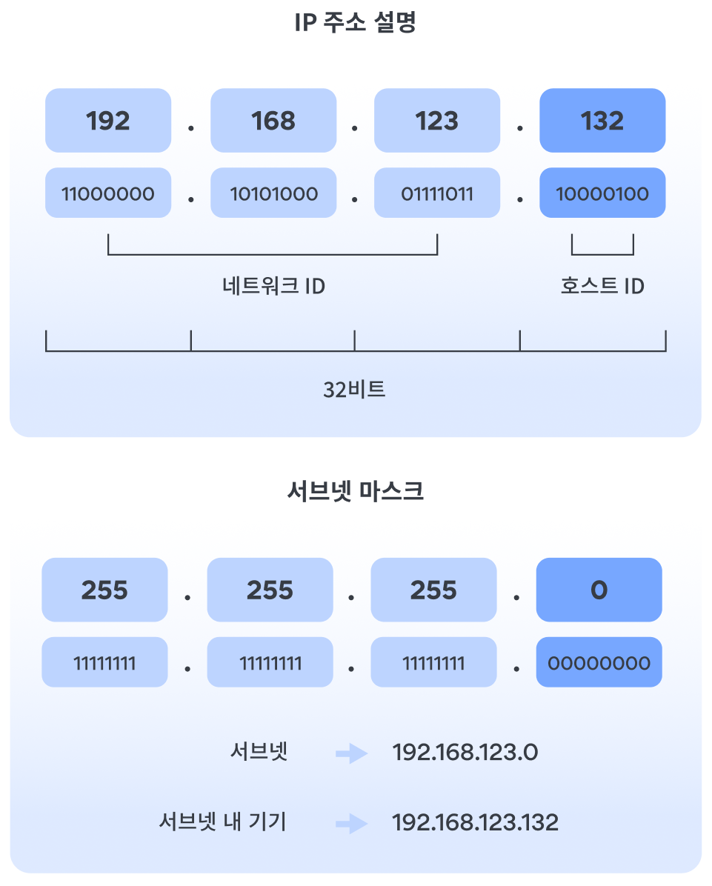

# ip주소의 서브넷 마스크 정복기

Date: April 13, 2025
담당자: 찬영 :
주제: 네트워크

# IP주소와 서브넷 마스크,서브네팅 톺아보기

---

## 1. IP 주소의 기본 구조

IP 주소는 총 **32비트**로 구성되어 있고, 이를 **8비트씩 4개로 나눠서** 표기함.

→ 우리가 흔히 보는 `192.168.1.1` 같은 형태가 이거임.

하지만 이 IP 주소는 단순히 숫자가 아니라

**네트워크 주소 + 호스트 주소**로 나뉘어 있음.

- **네트워크 주소**: 이 IP가 어떤 네트워크에 속해 있는지 나타냄
- **호스트 주소**: 그 네트워크 안에 있는 개별 장비(IP)를 식별함



> 만약 192.168.123.132 | 255.255.255.0 (192.168.123.132/24) 라고 
한다면 0 은 모든 걸 포함하기 때문에 
앞에 3칸은 네트워크 아이디가 되고 
뒤에 1자리가 호스트 아이디가 됨.
> 

이걸 구분하는 기준이 바로 **서브넷 마스크(Subnet Mask)** 임.

---

## 2. 서브넷 마스크란?

서브넷 마스크는 IP 주소 중에서 **어디까지가 네트워크고, 어디부터가 호스트인지** 알려주는 값임.

쉽게 말해, **앞부분은 네트워크, 뒷부분은 호스트**라는 선을 그어주는 역할.

### 예:

- IP 주소: `192.168.10.12`
- 서브넷 마스크: `255.255.255.0` → 즉, 앞의 24비트는 네트워크로 본다는 뜻 (CIDR: `/24`)

→ 네트워크 주소: `192.168.10.0`

→ 브로드캐스트 주소: `192.168.10.255`

→ usable host: `192.168.10.1 ~ 192.168.10.254`

→ 총 호스트 수: `2⁸ - 2 = 254`

## 근디 만약 서브넷 마스크가 `/25` 또는 `/26`이라면?

우선 기본 네트워크 대역이 `192.168.10.0/24`이라고 가정하고,

여기서 서브넷 마스크를 `/25`, `/26`으로 **쪼갠다는 건**

→ IP 주소를 더 작게 나눠서 여러 개의 작은 네트워크로 만든다는 의미임.

---

### `/25`로 서브네팅할 경우

- 원래는 `/24` → 256개 IP 주소 보유
- `/25`는 앞 25비트를 네트워크로 쓰고, 나머지 7비트는 호스트용
- → `2^7 = 128`개의 주소를 갖는 서브넷이 2개 생성됨

| 서브넷 번호 | 네트워크 주소 | 브로드캐스트 주소 | 호스트 범위 | 호스트 수 |
| --- | --- | --- | --- | --- |
| 0 | 192.168.10.0 | 192.168.10.127 | 192.168.10.1 ~ 192.168.10.126 | 126개 |
| 1 | 192.168.10.128 | 192.168.10.255 | 192.168.10.129 ~ 192.168.10.254 | 126개 |

> 총 호스트 수는 128 - 2 = 126개
> 
> 
> (1개는 네트워크 주소, 1개는 브로드캐스트로 빠짐)
> 

---

### `/26`으로 서브네팅할 경우

- `/26`은 앞 26비트를 네트워크로 쓰고, 나머지 6비트를 호스트로 사용
- → `2^6 = 64`개의 주소를 갖는 서브넷이 4개 생성됨

| 서브넷 번호 | 네트워크 주소 | 브로드캐스트 주소 | 호스트 범위 | 호스트 수 |
| --- | --- | --- | --- | --- |
| 0 | 192.168.10.0 | 192.168.10.63 | 192.168.10.1 ~ 192.168.10.62 | 62개 |
| 1 | 192.168.10.64 | 192.168.10.127 | 192.168.10.65 ~ 192.168.10.126 | 62개 |
| 2 | 192.168.10.128 | 192.168.10.191 | 192.168.10.129 ~ 192.168.10.190 | 62개 |
| 3 | 192.168.10.192 | 192.168.10.255 | 192.168.10.193 ~ 192.168.10.254 | 62개 |

> 호스트 수는 64 - 2 = 62개
> 
> 
> → **/26은 총 4개 서브넷 생성됨**
> 

---

### 이렇게 정리해보면

| 마스크 | 주소당 호스트 수 | 서브넷 개수 (/24 기준) |
| --- | --- | --- |
| /24 | 254 | 1 |
| /25 | 126 | 2 |
| /26 | 62 | 4 |
| /27 | 30 | 8 |
| /28 | 14 | 16 |
| /29 | 6 | 32 |
| /30 | 2 (Point-to-Point용) | 64 |

---

## 3. 서브네팅(Subnetting)이란?

서브네팅이란 하나의 IP 대역을 **작은 서브넷들로 쪼개는 작업**임.

왜 쪼개냐?

- IP 낭비 줄이려고
- 네트워크 관리 편하려고
- 보안과 역할을 분리하려고 (예: 퍼블릭 서브넷 vs 프라이빗 서브넷)

예를 들어 `/24`는 호스트가 254개 가능하지만,

10대만 필요한 상황이면 너무 크지 않습니까

그럼 `/28` 또는 `/29`로 쪼개서 효율적으로 사용함.


---

## 4. 네트워크 주소 / 브로드캐스트 주소 구하는 법

### 네트워크 주소

- 해당 IP 주소에서 **호스트 부분을 0으로 만든 값**

### 브로드캐스트 주소

- 해당 IP 주소에서 **호스트 부분을 전부 1로 만든 값**

---

### 예제:

**IP**: `192.168.10.130/26`

→ 26비트가 네트워크 → 6비트가 호스트

→ `2⁶ = 64`개 IP 사용 가능 (usable host는 62개)

서브넷 경계는 64 단위로 나뉨:

| 서브넷 번호 | 범위 |
| --- | --- |
| 0번째 | 192.168.10.0 ~ 192.168.10.63 |
| 1번째 | 192.168.10.64 ~ 192.168.10.127 |
| 2번째 | **192.168.10.128 ~ 192.168.10.191** |
| 3번째 | 192.168.10.192 ~ 192.168.10.255 |

→ `192.168.10.130`은 2번째 서브넷에 있음

- 네트워크 주소: `192.168.10.128`
- 브로드캐스트 주소: `192.168.10.191`
- usable host: `192.168.10.129 ~ 192.168.10.190`

---

### 그런데... 좀 더 심오한 계산 원리는 뭐냐..

> 사실 CIDR을 보고 호스트 범위를(서브넷 갯수) 구해서 해당하는 범위에 가장 첫번째(네트워크)주소랑 마지막(브로드캐스트)주소 구하는게 가장 쉽긴 함.
> 

근데 찐또배기 계산법은 무엇이냐하면 연산을 통해 계산하는 게 정석임. 

---

### 1) 네트워크 주소 계산: IP 주소 AND 서브넷 마스크

**IP 주소**: `192.168.10.130` →

2진수: `11000000.10101000.00001010.10000010`

**서브넷 마스크 (/26)**: `255.255.255.192` →

2진수: `11111111.11111111.11111111.11000000`

**AND 연산 결과**:

```
복사편집
11000000.10101000.00001010.10000010  (192.168.10.130)
AND
11111111.11111111.11111111.11000000  (255.255.255.192)
=
11000000.10101000.00001010.10000000  → 192.168.10.128

```

→ 네트워크 주소: **192.168.10.128**

---

### 2) 브로드캐스트 주소 계산: IP 주소 OR (~서브넷 마스크)

**~서브넷 마스크** (NOT 연산):

255.255.255.192 → 반전하면 `0.0.0.63`

2진수: `00000000.00000000.00000000.00111111`

**IP 주소**: `192.168.10.130` →

`11000000.10101000.00001010.10000010`

**OR 연산 결과**:

```
복사편집
11000000.10101000.00001010.10000010
OR
00000000.00000000.00000000.00111111
=
11000000.10101000.00001010.10111111  → 192.168.10.191

```

→ 브로드캐스트 주소: **192.168.10.191**

---

### 정리

| 항목 | 계산 방식 | 결과 |
| --- | --- | --- |
| 네트워크 주소 | IP AND 서브넷 마스크 | 192.168.10.128 |
| 브로드캐스트 주소 | IP OR (~서브넷 마스크) | 192.168.10.191 |

---

## 5. 공인 IP vs 사설 IP

### 공인 IP

- 인터넷에서 유일해야 하는 진짜 주소
- ISP(통신사)로부터 할당 받아야 함
- 예: `8.8.8.8`, `142.250.206.14`

### 사설 IP

- 내부 네트워크에서만 사용하는 주소
- 외부에서 직접 접근 불가 (NAT로 변환해서 통신)

### 사설 IP 대역

| 클래스 | 범위 |
| --- | --- |
| A | 10.0.0.0 ~ 10.255.255.255 |
| B | 172.16.0.0 ~ 172.31.255.255 |
| C | 192.168.0.0 ~ 192.168.255.255 |

**→ AWS에서 VPC 만들 때 기본으로 사설 IP 대역 사용**

---

## 6. 그 외 고정된 특수 IP 주소들

| 주소 | 설명 |
| --- | --- |
| `127.0.0.1` | 루프백 주소 (자기 자신) |
| `0.0.0.0` | 아무 IP도 지정되지 않았음을 의미 |
| `255.255.255.255` | 브로드캐스트 주소 (모든 호스트 대상으로 전송) |
| `169.254.x.x` | DHCP 실패 시 자동 할당 주소 (APIPA) |

---

### [문제 유형 1]

**주어진 서브넷 마스크에서 사용할 수 있는 호스트 수 구하기**

### 예제 1

- 192.168.1.0/26 네트워크에서 사용할 수 있는 호스트 수는?
    
    **풀이**:
    
    - /26 → 26비트가 네트워크 → 32 - 26 = 6비트가 호스트
    - 총 가능한 호스트 주소 수: 2⁶ = 64
    - 여기서 2개(네트워크, 브로드캐스트)는 제외해야 함
    
    **정답**: 64 - 2 = **62개**
    
    **요약**
    
    - 공식: `2^(32-서브넷비트) - 2`
    - 이유: 맨 앞은 네트워크, 맨 뒤는 브로드캐스트로 쓰기 때문

---

### [문제 유형 2]

**서브넷 마스크를 보고 네트워크 주소와 브로드캐스트 주소 구하기**

### 예제 2

- 192.168.10.0/25 네트워크의 네트워크 주소와 브로드캐스트 주소는?
    
    **풀이**:
    
    - /25 → 128단위로 나뉨 (왜냐면 2⁷ = 128)
    - 192.168.10.0 은 이미 첫 번째 블록 시작점
    - 주소 범위: `192.168.10.0 ~ 192.168.10.127`
    
    **정답**:
    
    - 네트워크 주소: **192.168.10.0**
    - 브로드캐스트 주소: **192.168.10.127**
    
    **계산 팁**
    
    서브넷 단위로 주소 구간을 나눈다 → 2ⁿ 단위로 범위가 나뉨
    

---

### [문제 유형 3]

**서브넷을 나눈 후, 특정 번째 서브넷 범위 구하기**

### 예제 3

- 192.168.1.0/24 네트워크를 /26 서브넷으로 나누었을 때, **두 번째 서브넷**의 네트워크 주소와 브로드캐스트 주소는?
    
    **풀이**:
    
    - /24 → 전체 주소 수: 256개
    - /26 → 서브넷당 주소 수: 2^(32-26) = 64개
    - 서브넷 개수: 256 / 64 = 4개
    - 0번째: 192.168.1.0 ~ 63
    - 1번째: **192.168.1.64 ~ 127** ← 여기!
    
    **정답**:
    
    - 네트워크 주소: **192.168.1.64**
    - 브로드캐스트 주소: **192.168.1.127**

---

### [문제 유형 4]

**브로드캐스트 주소 구하기**

### 예제 4

- 192.168.5.0/27 네트워크의 브로드캐스트 주소는?
    
    **풀이**:
    
    - /27 → 호스트 비트: 5비트 → 2⁵ = 32개 주소
    - 주소 범위: 192.168.5.0 ~ 192.168.5.31
    
    **정답**: 브로드캐스트 주소는 **192.168.5.31**
    

---

### [문제 유형 5]

**/24를 /26으로 쪼갰을 때 생성되는 서브넷 수**

### 예제 5

- 192.168.1.0/24 네트워크를 /26으로 나눌 때 서브넷 수는?
    
    **풀이**:
    
    - 차이: /26 - /24 = 2비트
    - 서브넷 수: 2² = **4개**
    
    **정답**: 4개
    
     **팁**:
    
    - **서브넷 수**는 `2^n` (n은 증가된 비트 수)

---

### [문제 유형 6]

**특정 IP가 서브넷에 포함되는지 확인**

### 예제 6

- 192.168.1.67은 192.168.1.0/26 네트워크에 포함되는가?
    
    **풀이**:
    
    - /26 → 64 단위 서브넷
    - 0번째 서브넷: 192.168.1.0 ~ 63
    - 192.168.1.67은 이 범위를 벗어남
    
    **정답**: 포함 안됨!
    

---

### 질문은 모하지

1. **IP 주소에서 네트워크 주소와 호스트 주소를 구분하는 기준은 무엇인가요?**
    
    → 서브넷 마스크 / CIDR
    
    -그럼 **CIDR에서 숫자가 커질수록 네트워크는 어떻게 변화하나요?**
    
2. **서브넷 마스크가 `255.255.255.192`일 때 호스트 수와 서브넷 수는?**
3. **`192.168.10.130/26`의 브로드캐스트 주소는 무엇이며, 어떻게 계산하나요?**
    
    → 서브넷 경계 범위 파악, 호스트 비트 계산
    
4. **/29와 /30 서브넷 마스크는 각각 몇 개의 호스트를 가질 수 있으며, 언제 사용하면 적절할까요?**
5. **다수의 서비스(웹, DB, 관리 서버 등)를 운영할 때 서브네팅을 활용해 네트워크를 어떻게 분리할 수 있을까요?**

---